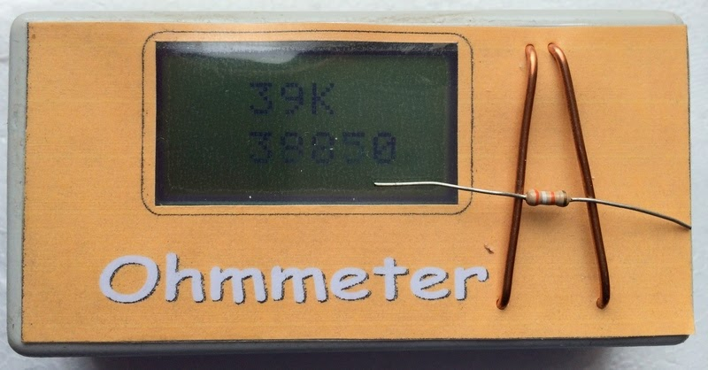

# Ohmmeter

based on design by [**Zabex**](http://www.zabex.de/frames/index.html)

HW and SW slighty adapted

*find more on my [website ](https://sites.google.com/site/tsrprojekt/elektronikprojekte/ohmmeter)*
